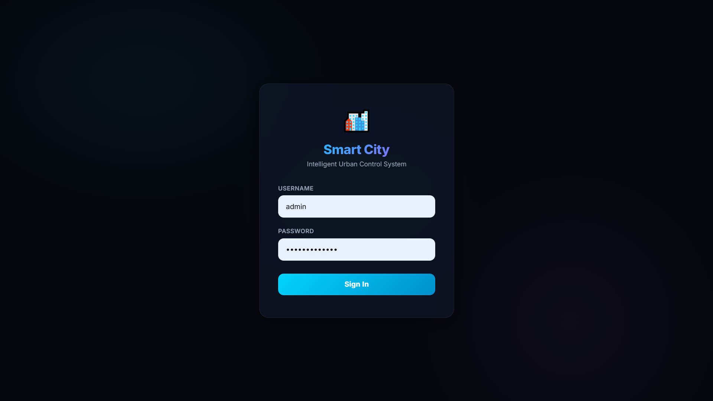
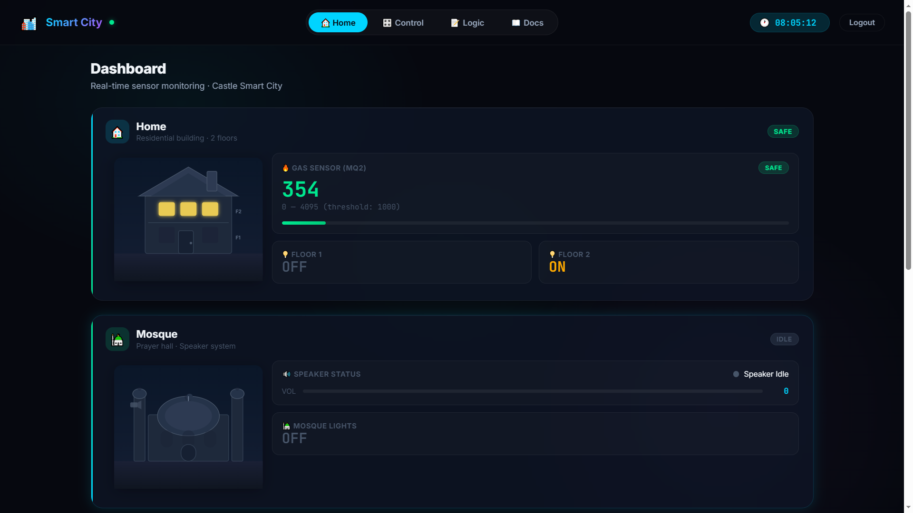
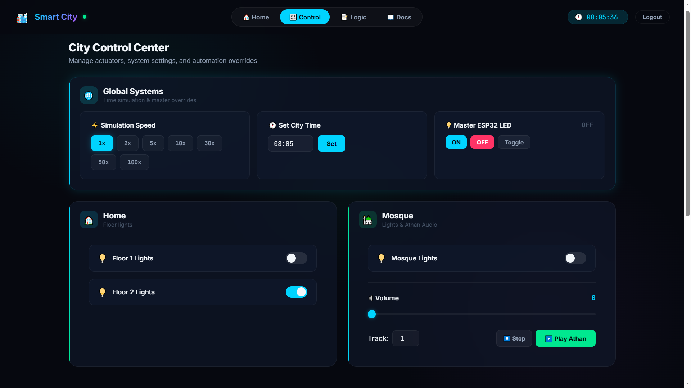
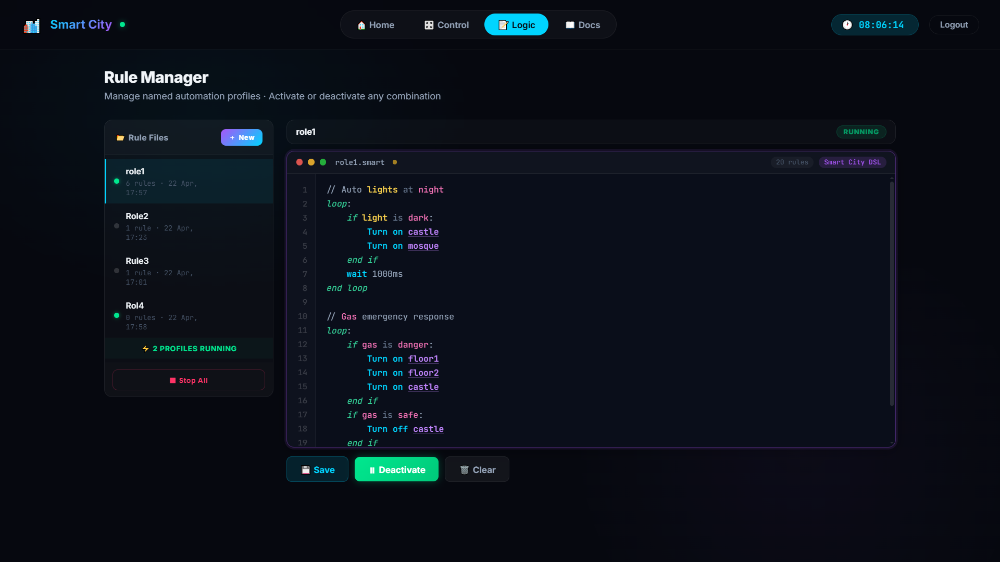
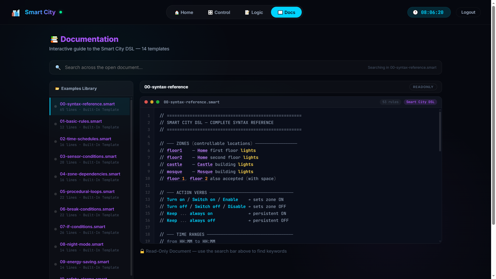

<p align="center">
  <h1 align="center">🏙️ Smart City — Backend</h1>
  <p align="center">
    Real-time IoT monitoring & control dashboard for intelligent urban infrastructure
    <br/>
    <b>Flask · SocketIO · MQTT · ESP32</b>
  </p>
</p>

---

## 📋 Table of Contents

- [Overview](#-overview)
- [Features](#-features)
- [Tech Stack](#-tech-stack)
- [Architecture](#-architecture)
- [Project Structure](#-project-structure)
- [Getting Started](#-getting-started)
- [API Reference](#-api-reference)
- [Rule Engine DSL](#-rule-engine-dsl)
- [Screenshots](#-screenshots)
- [Hardware Integration](#-hardware-integration)
- [License](#-license)

---

## 🔭 Overview

The Smart City Backend is a **Python Flask** server that acts as the bridge between an **ESP32 microcontroller** and a modern web dashboard. It receives live sensor telemetry via **MQTT** (HiveMQ Cloud), processes automation rules through a custom **Rules Engine**, and pushes real-time updates to connected browsers via **Socket.IO**.

The frontend is a single-page application (SPA) with client-side routing, featuring a **Home** dashboard, a **Control** panel, a **Logic Editor** (rule manager), and a **Docs** reference page.

---

## ✨ Features

| Category | Details |
|---|---|
| **Real-Time Telemetry** | Live gas sensor, light (LDR), IR obstacle, LED status, and speaker state via MQTT → WebSocket bridge |
| **City Clock** | Simulated city time with configurable speed (1×–100×) for time-based automation testing |
| **Illumination Zones** | Four controllable zones: `floor1`, `floor2`, `castle`, `mosque` with real-time state sync |
| **Rule Engine** | Natural-language DSL for declarative rules + procedural `loop:` blocks with `wait`, `if`, `break when` |
| **Rule Manager** | Multi-file rule store with CRUD operations, per-file activation/deactivation, JSON persistence |
| **Threshold Config** | Adjustable gas and street light thresholds from the dashboard |
| **Speaker Control** | DFPlayer Mini integration — play/stop audio, volume control (0–30) |
| **Authentication** | Token-based auth with Bearer tokens for all API endpoints |
| **Responsive UI** | Modern dark-theme SPA with glassmorphism, animated SVG city, and mobile support |

---

## 🛠️ Tech Stack

| Layer | Technology |
|---|---|
| **Backend** | Python 3.13, Flask 3.0 |
| **Real-Time** | Flask-SocketIO 5.3.6 (threading mode) |
| **IoT Protocol** | Paho MQTT 1.6.1, HiveMQ Cloud (TLS) |
| **Frontend** | Vanilla JS (ES Modules), CSS Custom Properties |
| **Hardware** | ESP32, MQ2 Gas Sensor, LDR, IR Sensors, DFPlayer Mini, LEDs |
| **Data Storage** | JSON file-based rule persistence |

---

## 🏗️ Architecture

```
┌──────────────┐       MQTT (TLS)       ┌──────────────────┐
│   ESP32 MCU  │ ◄──────────────────►   │  HiveMQ Cloud    │
│              │  smartcity/telemetry    │  MQTT Broker     │
│  • MQ2 Gas   │  smartcity/commands     └────────┬─────────┘
│  • LDR       │                                  │
│  • IR x2     │                                  │ MQTT
│  • DFPlayer  │                                  │
│  • LEDs      │                                  ▼
└──────────────┘                        ┌──────────────────┐
                                        │  Flask Backend   │
                                        │                  │
                                        │  • MQTT Handler  │
                                        │  • Rules Engine  │
                                        │  • City Timer    │
                                        │  • REST API      │
                                        │  • SocketIO      │
                                        └────────┬─────────┘
                                                 │
                                                 │ WebSocket + HTTP
                                                 ▼
                                        ┌──────────────────┐
                                        │  Web Dashboard   │
                                        │  (SPA)           │
                                        │                  │
                                        │  • Home Page     │
                                        │  • Control Panel │
                                        │  • Logic Editor  │
                                        │  • Docs Page     │
                                        └──────────────────┘
```

---

## 📁 Project Structure

```
backend/
│
├── app.py                    # Application entry point — starts MQTT, timer, and Flask server
├── config.py                 # MQTT broker credentials, topics, auth users, sensor defaults
├── extensions.py             # Shared Flask app, SocketIO, and MQTT client instances
├── auth.py                   # Token-based authentication (Bearer tokens, @require_auth decorator)
├── mqtt_handler.py           # MQTT connection, callbacks, telemetry ingestion & field normalization
├── city_timer.py             # Simulated city clock with configurable speed (1×–100×)
├── rules_engine.py           # Natural-language rule parser, evaluator, and procedural block executor
├── rules_store.py            # JSON-based CRUD persistence for rule files (data/rules_store.json)
├── socket_events.py          # SocketIO event handlers (connect/disconnect, initial state push)
├── requirements.txt          # Python dependencies
│
├── routes/                   # Flask Blueprints (modular route registration)
│   ├── __init__.py           # Blueprint registration helper
│   ├── api.py                # REST API: /api/login, /api/telemetry, /api/command, /api/timer
│   ├── rules.py              # Rules CRUD API: /api/rules (list, create, read, update, delete, toggle)
│   └── views.py              # Page routes: / (dashboard), /docs (documentation)
│
├── data/                     # Persistent data storage
│   └── rules_store.json      # Saved rule files (auto-created)
│
├── templates/                # Jinja2 HTML templates
│   ├── index.html            # Main SPA shell (imports modular CSS + JS)
│   └── docs.html             # Rule engine documentation page
│
└── static/                   # Frontend assets
    ├── app.js                # Legacy monolithic JS (kept for reference)
    ├── style.css             # Legacy monolithic CSS (kept for reference)
    │
    ├── css/                  # Modular stylesheets
    │   ├── variables.css     # CSS custom properties (colors, spacing, shadows)
    │   ├── base.css          # Reset, typography, body background
    │   ├── login.css         # Login form styles
    │   ├── nav.css           # Navigation bar & tab styles
    │   ├── dashboard.css     # Home page SVG city & sensor cards
    │   ├── controls.css      # Control panel sliders, buttons, toggles
    │   ├── editor.css        # Logic editor — syntax highlighting, sidebar, line numbers
    │   └── responsive.css    # Media queries for mobile/tablet layouts
    │
    └── js/                   # Modular JavaScript (ES Modules)
        ├── app.js            # Module entry point — initializes router, socket, state
        ├── state.js          # Centralized application state store
        ├── api.js            # HTTP API wrapper (fetch + auth token)
        ├── socket.js         # SocketIO connection & event listeners
        ├── router.js         # Client-side hash router (#home, #control, #logic, #docs)
        ├── updaters.js       # DOM updater functions for telemetry data
        ├── editor.js         # Code editor — syntax highlighting, line numbers, cursor
        ├── rules_manager.js  # Rule file sidebar — create, rename, delete, activate
        │
        ├── components/       # Reusable UI components
        │   ├── login.js      # Login form component
        │   ├── svg.js        # Animated SVG city illustration (buildings, lights, sky)
        │   └── toggle.js     # Toggle switch component
        │
        └── pages/            # Page renderers (called by router)
            ├── home.js       # Home page — SVG city, sensor overview, city clock
            ├── control.js    # Control page — thresholds, speaker, illumination toggles
            ├── logic.js      # Logic page — rule manager + code editor (two-column layout)
            └── docs.js       # Docs page — rule language reference & code templates
```

---

## 🚀 Getting Started

### Prerequisites

- **Python 3.10+** installed
- **ESP32** flashed with the companion PlatformIO firmware (connects to the same MQTT broker)
- Internet connection (for HiveMQ Cloud MQTT broker)

### Installation

1. **Clone the repository**

   ```bash
   git clone https://github.com/AbdoSleem552/SmartCity-Backend.git
   cd SmartCity-Backend
   ```

2. **Create a virtual environment** (recommended)

   ```bash
   python -m venv venv

   # Windows
   venv\Scripts\activate

   # Linux/macOS
   source venv/bin/activate
   ```

3. **Install dependencies**

   ```bash
   pip install -r requirements.txt
   ```

4. **Configure MQTT credentials** (if using your own broker)

   Edit `config.py`:

   ```python
   MQTT_BROKER   = "your-broker-url"
   MQTT_PORT     = 8883
   MQTT_USER     = "your-username"
   MQTT_PASSWORD = "your-password"
   ```

5. **Run the server**

   ```bash
   python app.py
   ```

6. **Open the dashboard**

   Navigate to **[http://localhost:5000](http://localhost:5000)** in your browser.

### Default Login Credentials

| Username | Password |
|---|---|
| `admin` | `smartcity2026` |

---

## 📡 API Reference

All API endpoints (except `/api/login`) require a `Authorization: Bearer <token>` header.

### Authentication

| Method | Endpoint | Description |
|---|---|---|
| `POST` | `/api/login` | Login with username/password → returns Bearer token |
| `POST` | `/api/logout` | Invalidate the current token |

### Telemetry & Commands

| Method | Endpoint | Description |
|---|---|---|
| `GET` | `/api/telemetry` | Get latest sensor data, illumination state, thresholds, and city time |
| `POST` | `/api/command` | Send a command to the ESP32 via MQTT |

#### Command Actions

| Action | Payload Fields | Description |
|---|---|---|
| `illuminate` | `zone`, `state` (`on`/`off`) | Toggle an illumination zone |
| `set_gas_threshold` | `threshold` (0–4095) | Update gas danger threshold |
| `set_light_threshold` | `threshold` (0–4095) | Update street light LDR threshold |
| `city_lights_logic` | `logic` (text) | Push raw rule text to the engine |
| *(any other)* | *(forwarded as-is)* | Forwarded directly to ESP32 via MQTT |

### City Timer

| Method | Endpoint | Description |
|---|---|---|
| `GET` | `/api/timer` | Get current city time |
| `POST` | `/api/timer` | Set city time (`set_time`: `"HH:MM"`) and/or speed (`speed`: 1–100) |

### Rules CRUD

| Method | Endpoint | Description |
|---|---|---|
| `GET` | `/api/rules` | List all rule files (without content) |
| `POST` | `/api/rules` | Create a new rule file (`name`, `content`) |
| `GET` | `/api/rules/<id>` | Get a single rule file (with content) |
| `PUT` | `/api/rules/<id>` | Update rule name and/or content |
| `DELETE` | `/api/rules/<id>` | Delete a rule file |
| `POST` | `/api/rules/<id>/toggle` | Toggle rule active/inactive |
| `POST` | `/api/rules/<id>/activate` | Explicitly activate a rule |
| `POST` | `/api/rules/<id>/deactivate` | Explicitly deactivate a rule |
| `POST` | `/api/rules/deactivate` | Deactivate ALL rules |

### WebSocket Events

| Event | Direction | Description |
|---|---|---|
| `telemetry` | Server → Client | Real-time sensor data broadcast |
| `city_time` | Server → Client | City clock tick (every second) |
| `illumination_update` | Server → Client | Zone illumination state changed |
| `config_update` | Server → Client | Threshold or logic configuration changed |

---

## 📝 Rule Engine DSL

The Smart City backend includes a custom **natural-language Domain Specific Language (DSL)** for writing automation rules.

### Declarative Rules

```
Turn on floor1 from 18:00 to 06:00
Turn off castle when light above 2000
Enable mosque when dark
Switch off floor2 when gas danger
Keep floor1 always on
```

### Procedural Blocks

```
loop:
  Turn on floor1
  wait 2 sec
  Turn off floor1
  wait 1 sec
  break when gas danger
end
```

### Supported Syntax

| Element | Examples |
|---|---|
| **Actions** | `Turn on`, `Turn off`, `Switch on`, `Switch off`, `Enable`, `Disable`, `Keep` |
| **Zones** | `floor1`, `floor2`, `castle`, `mosque` |
| **Time Ranges** | `from HH:MM to HH:MM`, `between HH:MM and HH:MM` |
| **Conditions** | `when dark`, `when bright`, `when gas safe`, `when gas danger`, `when light below N`, `when light above N`, `when <zone> is on/off` |
| **Procedural** | `loop: ... end`, `wait N ms/sec`, `break when <condition>`, `if <condition>: ... end if` |

---

## 📸 Screenshots

> **📌 TODO:** Add screenshots of the following pages:

### Login Page

<!-- `🖼️ Screenshot needed — Login page with glassmorphism form` -->

### Home Page — Dashboard

<!-- `🖼️ Screenshot needed — Home page with animated SVG city, sensor cards, and city clock` -->

### Control Panel

<!-- `🖼️ Screenshot needed — Control page with threshold sliders, speaker controls, and illumination toggles` -->

### Logic Editor

<!-- `🖼️ Screenshot needed — Logic page with rule file sidebar and syntax-highlighted code editor` -->

### Docs Page

<!-- `🖼️ Screenshot needed — Documentation page with rule language syntax reference` -->

---

## 🔌 Hardware Integration

### MQTT Topics

| Topic | Direction | Format |
|---|---|---|
| `smartcity/telemetry` | ESP32 → Backend | JSON: `{ gas, light, object, ir2, vol, led, speaker_active }` |
| `smartcity/commands` | Backend → ESP32 | JSON: `{ action, ... }` |

### Sensor Mapping

| Sensor | Telemetry Key | Type | Description |
|---|---|---|---|
| MQ2 Gas Sensor | `gas` | `int` (0–4095) | Analog gas concentration reading |
| LDR Light Sensor | `light` | `int` (0–4095) | Ambient light level |
| IR Sensor 1 | `ir1` (from `object`) | `bool` | Obstacle / object detection |
| IR Sensor 2 | `ir2` | `bool` | Parking slot occupancy |
| LED State | `led` | `string` (`ON`/`OFF`) | Current LED state |
| Speaker Active | `speaker_active` | `bool` | DFPlayer playback state |
| Speaker Volume | `speaker_volume` (from `vol`) | `int` (0–30) | Current volume level |

---

## 📄 License

This project was developed as part of a Smart City IoT academic project.

---

<p align="center">
  Made with ❤️ using Flask, SocketIO & MQTT
</p>
